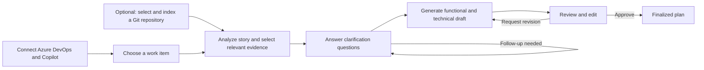

# sdev-aix

sdev-aix turns Azure DevOps work items into functional and technical plans you can review, edit, and approve. It asks clarification questions before drafting, can use evidence from a repository you select, and keeps plans on your machine. The application is in early development and is intended for one user on a trusted computer.

## Get started with Docker Compose

You need Docker Desktop or Docker Engine with Compose v2. From the project root:

1. **Optional: make your repositories available.** Create a root `.env` file (it is ignored by Git) and set `REPOSITORY_WORKSPACE` to the **host directory containing** the repositories you want to browse:

   ```dotenv
   REPOSITORY_WORKSPACE=/absolute/path/to/projects
   # Optional: FRONTEND_PORT=8080
   ```

   On Windows with Docker Desktop, a path such as `C:/Users/you/Projects` works if the drive is shared with Docker. Compose mounts this folder read-only at `/workspace` inside the containers. If you omit it, you can still plan from work items, but the repository picker will not show your projects. You do **not** need to put PATs or an encryption key in this file for Compose.

2. **Start the app:**

   ```sh
   docker compose up --build -d
   ```

3. **Open** <http://localhost:8080> (or the `FRONTEND_PORT` you chose). In **Connections**:
   - Connect Azure DevOps with a PAT that can read work items, projects, teams, and identities.
   - Connect GitHub Copilot with a user-owned fine-grained PAT with the **Copilot Requests** account permission and Copilot access. This is a separate PAT from Azure DevOps.
   - Optionally, browse to a Git repository under your workspace and click **Connect and index**. Choosing a folder only fills the path field; indexing starts when you confirm. Including uncommitted changes requires your explicit choice.

4. **Create a plan** from a work item. Answer the questions, generate a provisional draft, edit or request revisions, and finalize when you are satisfied.



The repository is optional: without a ready, relevant index, the plan uses the story and your answers. Generated plans are provisional until you approve them.

### Everyday commands

```sh
docker compose ps              # Check service status
docker compose logs -f         # Follow logs
docker compose down            # Stop; keep your saved data
```

Compose keeps plans, the index, checkpoints, and the encryption key in a named `backend-data` volume. Back up the **entire** volume if you need to retain data and decrypt saved PATs. `docker compose down -v` permanently deletes that volume; don't use it unless you intend to erase local data. After changing `REPOSITORY_WORKSPACE`, recreate the services with `docker compose up -d --force-recreate`.

## Architecture at a glance

- **Web app and API:** React provides Connections, work items, and plan review. FastAPI reads Azure DevOps work items, handles connections, and stores plans in local SQLite. Background workers handle indexing and planning so long-running work survives a page refresh.
- **Repository index:** A separate worker reads the selected Git working tree without running Git commands. It skips symlinks, secret-like files, dependencies, binaries, and oversized files; re-indexing reuses unchanged chunks. Tree-sitter identifies Python, JavaScript, and TypeScript code structures. SQLite FTS5 searches paths, identifiers, and source text, then retrieves a small set of relevant excerpts and related code or tests. A plan saves the repository snapshot and exact excerpts used for its analysis.
- **Planning workflow:** LangGraph checkpoints story analysis and clarification. It pauses for answers, resumes from the checkpoint, and may ask a focused follow-up. Drafts and revisions are separate durable worker jobs: Copilot receives the saved story, answers, and **pinned** excerpts, not a fresh read of a repository that may have changed. The worker validates generated sections before saving a new revision; failed jobs can be retried without replacing the previous draft.

## Agent security and limits

- **No tools for Copilot:** It receives selected text but no shell, filesystem, Git, or MCP tools. Repository access belongs to the backend indexer, not the model.
- **Limited, untrusted inputs:** Story text, answers, feedback, and code excerpts are data, not instructions. Only bounded, selected excerpts are sent; excluded files are not indexed. A model can still make mistakes, so inspect every draft before approval.
- **Explicit repository access:** Compose mounts the configured workspace read-only. You select which repository to index and whether to include uncommitted changes. Plans retain their original evidence even after a later re-index.
- **Backend-only credentials:** Saved Azure DevOps and Copilot PATs are encrypted in backend storage and are not returned to the browser as saved values or included in model prompts. Don't put secrets in `VITE_*` variables—they become part of the browser bundle.
- **Local use only:** The app has no user authentication or TLS. Compose publishes only the frontend on `127.0.0.1`; do not expose it to a network or the internet. Confirm that your organization permits sending the selected work item and excerpts to GitHub Copilot.

## Development setup

For development without Compose, use Python 3.12, Node.js 24, and npm 11. Set `CREDENTIAL_ENCRYPTION_KEY` in a private `backend/.env` (see `dist.env`); generate a value with:

```sh
python -c "from cryptography.fernet import Fernet; print(Fernet.generate_key().decode())"
```

Start the backend and both workers in separate terminals from `backend/`:

```sh
python3.12 -m venv .venv
. .venv/bin/activate
pip install -e '.[dev]'
uvicorn app.main:app --reload
```

```sh
cd backend
. .venv/bin/activate
python -m app.planning.worker
```

```sh
cd backend
. .venv/bin/activate
python -m app.codebase.worker
```

For the real API, set `VITE_USE_MOCK_API=false` in `frontend/.env.local`; the frontend otherwise uses a deterministic demo. Then run:

```sh
cd frontend
npm ci
npm run dev
```

Open the URL Vite prints (usually <http://localhost:5173>). For repository browsing with a host-run backend, set `REPOSITORY_ALLOWED_ROOTS` in `backend/.env` to a parent directory containing your Git repositories. Run frontend checks from `frontend/` with `npm run lint`, `npm run typecheck`, `npm run test`, and `npm run build`.

## License

[MIT](LICENSE)
